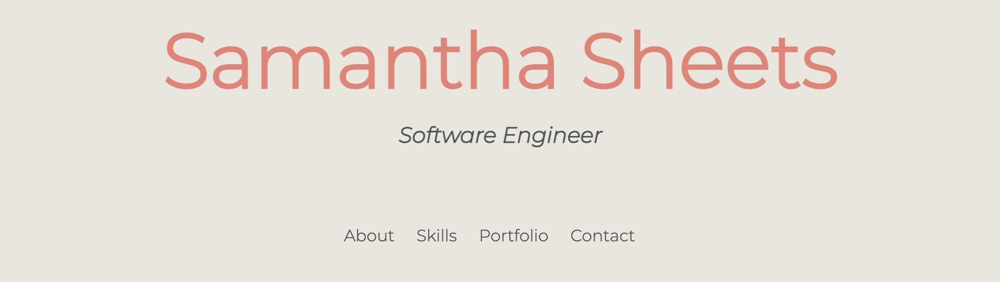

# Samantha Sheets' Porfolio Web Page

My porfolio web page explains more about me, professionally and personally, provides examples of my work, and includes a section to contact me.

## Live Demo

[Live Demo](https://7424243.github.io/Portfolio/)

## Screenshot

## Summary

Users can learn more about me by reading through the Intro and About Me sections. These sections provide personal and professional details about where I've been and where I hope to be someday. Users can also get a glimpse of some of my work in the My Portfolio section. This section provides snippets of what a project is about and links to the live demos and GitHub repos. Finally, users are encouraged to contact me or connect on Social Media in the Contact Me section.

## Built With

* HTML
* CSS